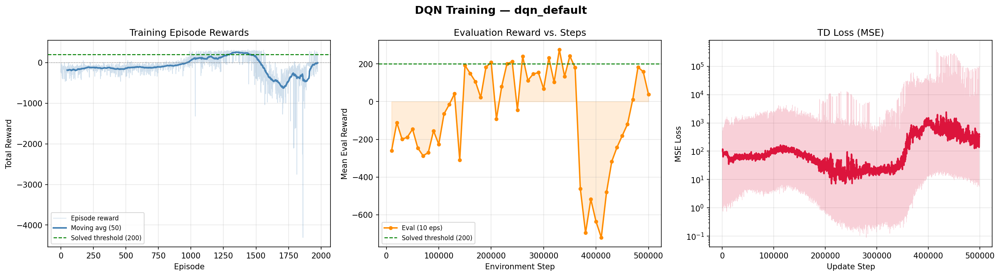

# DQN Agent for LunarLander-v3

A Deep Q-Network agent trained to solve the LunarLander-v3 environment using PyTorch.

## Results
| Metric | Value |
|---|---|
| Best eval reward | 210.9 |
| Demo mean reward | 284.4 |
| Random baseline | -186.5 |
| Training time | ~12 min (GPU) |

## Demo


## Architecture
- Q-Network: 2 × 256 hidden units, ReLU, Kaiming init
- Replay buffer: 100,000 transitions
- Epsilon-greedy: 1.0 → 0.05 over 200k steps
- Target network: hard update every 500 steps
- Optimizer: Adam (lr=1e-3), gradient clipping at 10.0

## Usage
```bash
pip install -r requirements.txt
python dqn_lunarlander.py --mode train --timesteps 500000
python dqn_lunarlander.py --mode eval --checkpoint checkpoints/dqn_default_best.pt
```

## Tech Stack
Python 3.12 · PyTorch 2.6 (CUDA) · Gymnasium 0.29 · NumPy · Matplotlib
